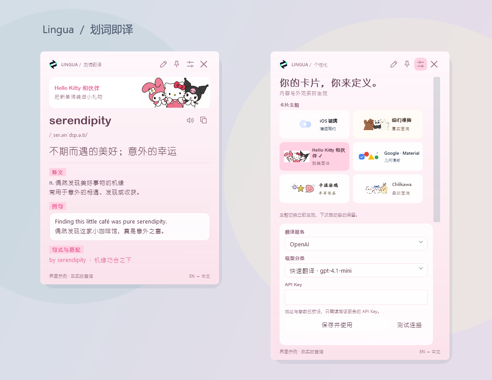
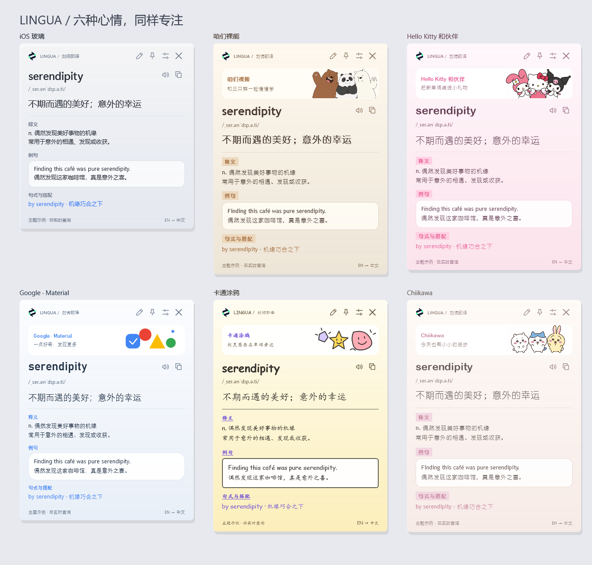

<p align="center"></p>
<h1 align="center">LinguaSelect</h1>
<p align="center">Windows 玻璃划词翻译卡片 · Select, translate, learn.</p>

选中文字后，在鼠标旁自动显示翻译卡片。译文、音标、例句和句式紧密排列，支持自由开关展示内容。

## 下载与运行

在本仓库的 **Releases** 下载 `LinguaSelect-v2.4.0-Windows.zip`，解压后双击 `LinguaSelect.exe`。

- Windows 10 / 11，需 .NET Framework 4.8。
- Windows 11 22H2 及以后支持系统 Acrylic 背景；其他环境使用半透明卡片回退。
- 免安装；关闭卡片后驻留托盘，右键托盘图标可退出。

## 功能

- 划词后直接查询，不抢走原软件焦点。
- 翻译、音标、系统语音朗读、词典释义、双语例句和 AI 句式解析。
- 原文、音标、译文、释义、例句、句式六个模块独立开关。
- 六套主题：默认 iOS 玻璃、咱们裸熊、Hello Kitty 和伙伴、Google Material、卡通涂鸦、Chiikawa。主题即时切换并自动保存。
- 紧凑布局、玻璃浓度调节、固定卡片与手动输入。
- OpenAI、DeepSeek、Qwen 模型与接口预设：选择分类后只需填写 API Key。
- 密钥通过 Windows DPAPI 按用户加密保存，不同服务分别存储。



预览由实际界面控件和示例文本生成，不是实时翻译结果。原生窗口样式截图见 [native-edge-preview.png](native-edge-preview.png)。

## 卡片主题

右上角「自定义」→「卡片主题」即可切换。每套包含配色、控件样式、主题字体排版和内置插画。标题、中文译文、正文、标签和设置控件随主题变化；音标保持常规字体。使用 Windows 已安装字体，缺失时自动回退。咱们裸熊、Hello Kitty 和伙伴、Chiikawa 使用 AI 生成的 PNG 角色素材；其他主题保留 SVG。角色与品牌主题为非官方设计。



## 使用

1. 启动应用，在支持 UI Automation 文本选区的软件中选中文字。
2. 松开鼠标，卡片自动出现。右上角可固定、输入或自定义。
3. 点击喇叭朗读；右键可重试、复制、手动输入或退出。
4. 无法读取选区时可尝试 `Ctrl+Alt+T`，或手动复制、粘贴。

## 模型预设

| 服务 | 快速翻译 | 均衡学习 | 深入解析 |
| --- | --- | --- | --- |
| OpenAI | gpt-4.1-mini | gpt-4.1 | gpt-5-mini |
| DeepSeek | deepseek-v4-flash | deepseek-v4-pro | deepseek-v4-pro，思考模式 |
| Qwen | qwen-flash | qwen-plus | qwen3-max |

Qwen 提供北京和新加坡地域。请使用对应服务、对应地域的 API Key。分类是应用内的场景划分，不是服务商套餐；模型权限和费用取决于你的账户。预设依据 2026-09-15 的官方文档，模型后续变化时可使用自定义兼容接口。

无需 Key 的基础模式使用 MyMemory 和 Free Dictionary API；完整生成式例句与句式解析需要配置 AI 服务。

## 隐私与限制

- 开启自动翻译时，选中文本会发送至当前翻译服务。请按需暂停或排除指定应用。
- 不读取全文，不自动改写剪贴板，不将查询历史写入磁盘。内存缓存最多 20 项。
- 本地配置位于 `%LOCALAPPDATA%\LinguaSelect\settings.json`，本仓库和发布包均不包含用户配置或密钥。
- 选区读取依赖 UI Automation TextPattern，并非所有浏览器、编辑器或 PDF 阅读器均兼容。
- 不支持 OCR、扫描 PDF、管理员权限窗口或安全桌面。可使用手动粘贴。
- 基础翻译最多 500 UTF-8 字节，AI 查询最多 2000 字符。公共服务可能限流。
- 语音依赖 Windows 已安装的语音包；没有对所有设备的扬声器输出进行验证。
- AI 返回内容可能不准确。发布检查未使用真实用户 AI Key，不代表已验证所有服务商的鉴权与账户权限。

## 从源码构建

使用 Windows 自带 .NET Framework C# 编译器，无需额外 NuGet 包：

```powershell
powershell -NoProfile -ExecutionPolicy Bypass -File .\build.ps1
```

重新生成多尺寸 ICO：

```powershell
powershell -NoProfile -ExecutionPolicy Bypass -File .\make-icon.ps1
```

测试（GUI 程序请通过 `Start-Process -Wait` 等待完成）：

```powershell
Start-Process .\LinguaSelect.exe -ArgumentList '--self-test' -Wait
Start-Process .\LinguaSelect.exe -ArgumentList '--ui-test' -Wait
```

`--self-test --network` 会以固定词 `hello` 测试公共翻译接口。`--preview` 生成示例界面图；`--native-preview` 在受控测试背景中生成原生窗口截图。

## 项目结构

- `LinguaSelect.cs`：启动入口、配置、翻译服务、选区读取与检查。
- `GlassWindow.cs` / `Card.xaml`：卡片交互和 WPF 样式。
- `ServicePresets.cs`：服务商、模型与参数预设。
- `assets/logo.png` / `assets/app.ico`：应用 Logo 与多尺寸 Windows 图标。
- `icons.svg`：操作图标。
- `assets/themes`：AI 角色插画与生成提示词。
- `Themes.cs` / `themes.svg`：主题配置与矢量装饰；`--theme-preview` 生成六套主题预览。

详细说明见 [使用说明.md](使用说明.md)。项目尚未指定开源许可证。
